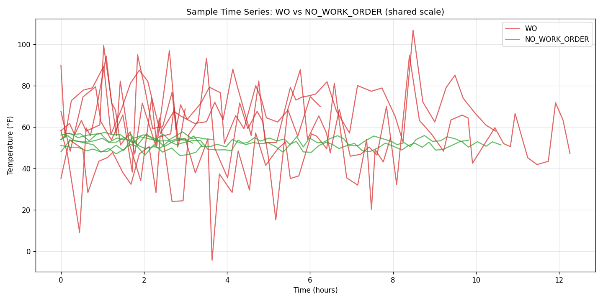
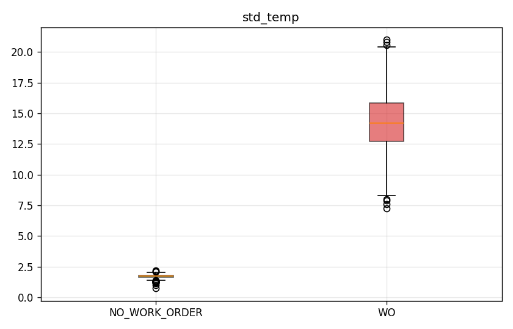
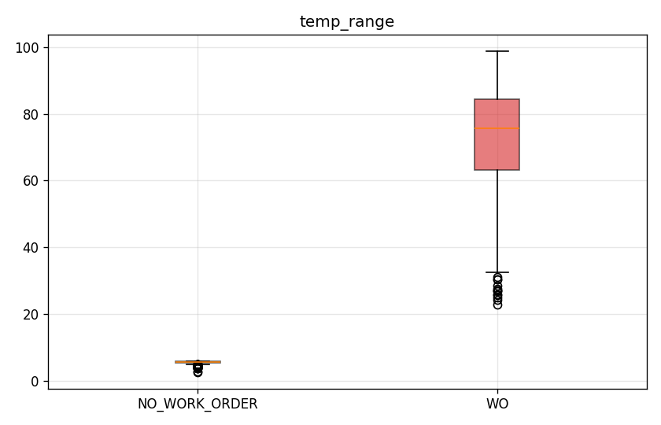
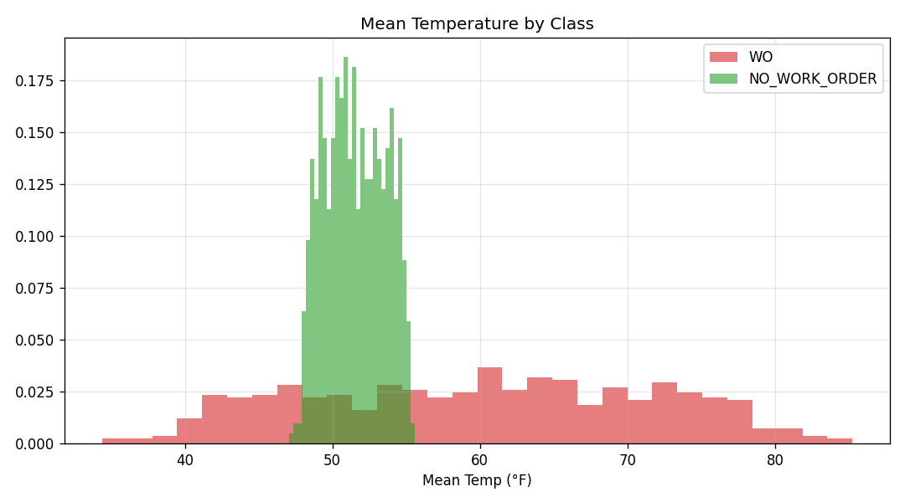
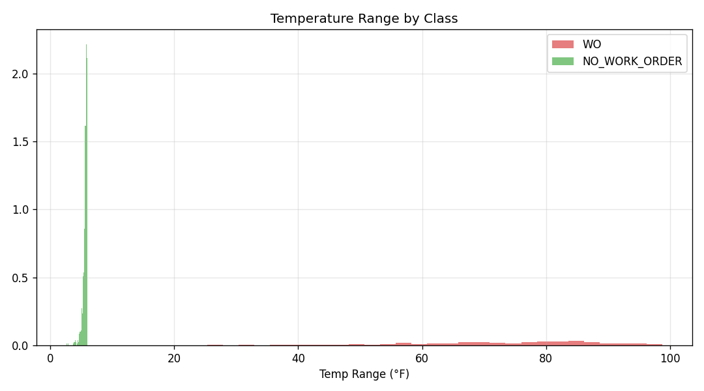
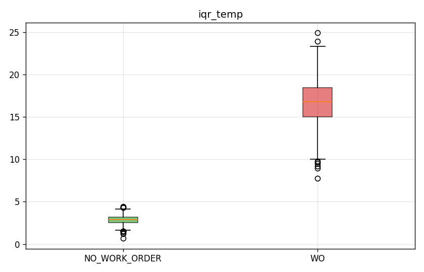
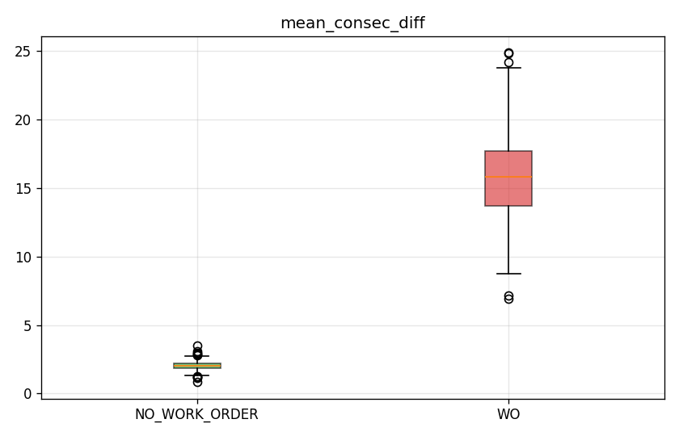
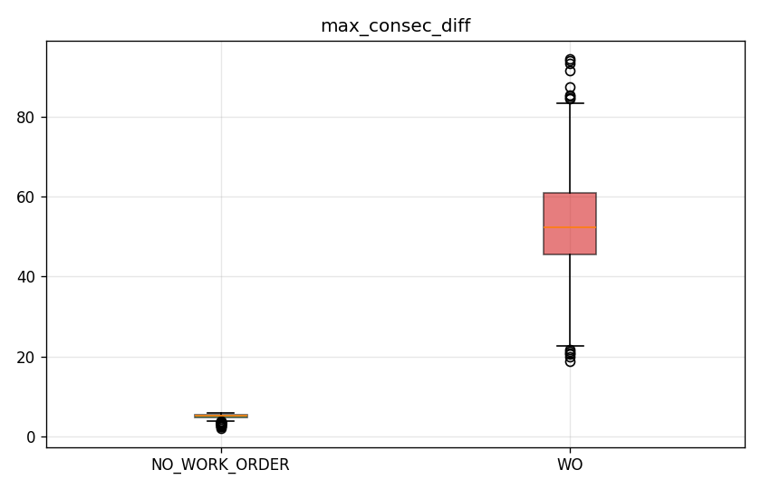
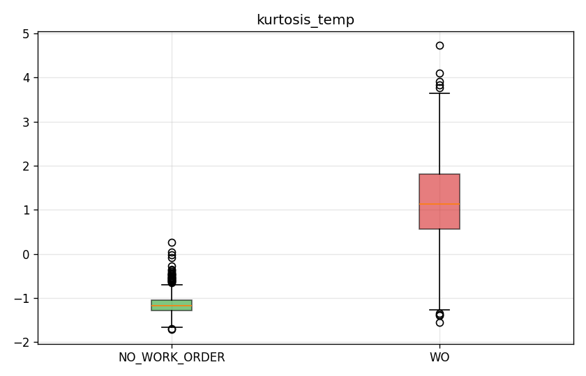
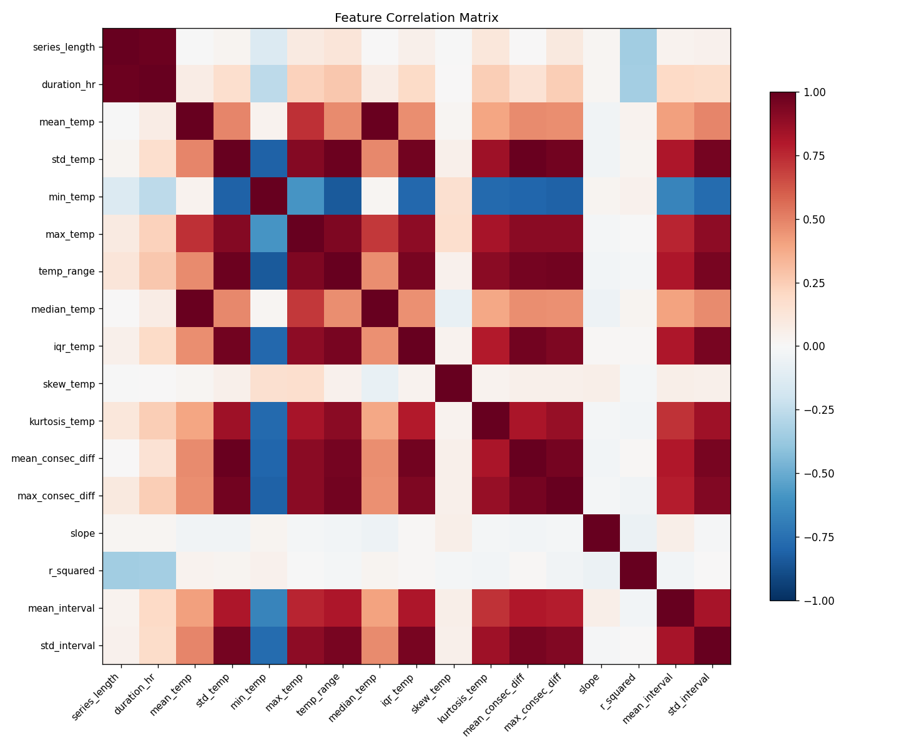

# HVAC Work-Order Prediction API

Predicts whether an HVAC unit needs a service work order (`WO`) or not (`NO_WORK_ORDER`) from IoT temperature time-series. Logistic regression, 1,200 training samples, served over FastAPI.

---

## Project Structure

```
├── artifacts/
│   ├── logistic.joblib        # Trained logistic regression (production model)
│   ├── scaler.joblib          # StandardScaler fitted during training
│   └── visualizations/        # EDA plots saved during notebook run
├── data/
│   ├── training_data.pkl      # Raw training dataset (1,200 records)
│   ├── demo_single.json       # Example single-unit request payload
│   └── demo_batch.json        # Example multi-unit batch payload
├── notebooks/
│   └── eda.ipynb              # EDA, feature engineering, model training & evaluation
├── src/
│   ├── config.py              # All constants - paths, model version, thresholds
│   ├── features.py            # 23 statistical features, identical at train and inference time
│   ├── inference.py           # predict() - loads model once, runs batched inference
│   ├── schemas.py             # Pydantic request / response models
│   └── app.py                 # FastAPI application - routes, validation, IST logging
└── requirements.txt
```

---

## Setup

```bash
python3 -m venv .venv
source .venv/bin/activate
pip install -r requirements.txt
```

## Run the API

```bash
uvicorn src.app:app --reload
```

Interactive docs: [http://localhost:8000/docs](http://localhost:8000/docs)

---

## Endpoints

| Method | Path             | Description                             |
|--------|------------------|-----------------------------------------|
| GET    | `/health`        | Liveness check                          |
| POST   | `/predict`       | Single HVAC unit prediction             |
| POST   | `/predict_batch` | Batch prediction across multiple units  |

---

## Request Format

Both endpoints use the same per-unit payload shape. `request_id` is optional - a UUID is auto-generated if you leave it out.

```json
{
  "hvac_id": "HVAC-UNIT-042",
  "timeseries_data": [
    { "timestamp": 1713225600.0, "temperature": 78.3 },
    { "timestamp": 1713226200.0, "temperature": 81.1 }
  ]
}
```

The batch endpoint wraps a list of these under a `records` key:

```json
{
  "records": [
    { "hvac_id": "HVAC-UNIT-001", "timeseries_data": [ ... ] },
    { "hvac_id": "HVAC-UNIT-002", "timeseries_data": [ ... ] }
  ]
}
```

---

## Response Format

```json
{
  "hvac_id": "HVAC-UNIT-042",
  "request_id": "a1b2c3d4-e5f6-7890-abcd-ef1234567890",
  "label": "WO",
  "confidence": 0.865,
  "risk_level": "HIGH",
  "predicted_at": "2026-04-16T05:30:00Z",
  "model_version": "1.0.0"
}
```

The batch response wraps results in a `results` list.

---

## Trial Run

* Start the server first using 
```bash
uvicorn src.app:app --reload
```
then run the commands below.

---

### Single Prediction

```bash
curl -X POST http://localhost:8000/predict \
  -H "Content-Type: application/json" \
  -d @data/demo_single.json
```


**Output**:

```
{
  "hvac_id": "HVAC-UNIT-001",
  "request_id": "3b204e38-c69d-4563-9eb4-9830a417d958",
  "label": "NO_WORK_ORDER",
  "confidence": 0.9997863442815071,
  "risk_level": "LOW",
  "predicted_at": "2026-04-16T01:52:58.842791Z",
  "model_version": "1.0.0"
}
```

---

### Batch Prediction

```bash
curl -X POST http://localhost:8000/predict_batch \
  -H "Content-Type: application/json" \
  -d @data/demo_batch.json
```


**Output**:
```
{
  "results": [
    {
      "hvac_id": "HVAC-UNIT-001",
      "request_id": "41749316-2c93-4f4e-b800-d9e462a883b5",
      "label": "NO_WORK_ORDER",
      "confidence": 0.9997863442815071,
      "risk_level": "LOW",
      "predicted_at": "2026-04-16T01:51:17.152100Z",
      "model_version": "1.0.0"
    },
    {
      "hvac_id": "HVAC-UNIT-002",
      "request_id": "76b4383d-4986-4352-b1d9-ddb28cdf6afc",
      "label": "NO_WORK_ORDER",
      "confidence": 0.9965953177843264,
      "risk_level": "LOW",
      "predicted_at": "2026-04-16T01:51:17.152100Z",
      "model_version": "1.0.0"
    },
    {
      "hvac_id": "HVAC-UNIT-003",
      "request_id": "d470fea8-5ad2-4de3-8f52-b67e45d7e6c8",
      "label": "WO",
      "confidence": 0.630986607156658,
      "risk_level": "MEDIUM",
      "predicted_at": "2026-04-16T01:51:17.152100Z",
      "model_version": "1.0.0"
    },
    {
      "hvac_id": "HVAC-UNIT-004",
      "request_id": "b8c5b52c-fc89-463d-b407-2318faba0150",
      "label": "WO",
      "confidence": 0.8645972159094679,
      "risk_level": "HIGH",
      "predicted_at": "2026-04-16T01:51:17.152100Z",
      "model_version": "1.0.0"
    }
  ]
}
```

---

## Validation

Checked on every request before the model runs. Returns HTTP 422 if either fails.

| Rule               | Value              |
|--------------------|--------------------|
| Minimum readings   | 5 timestamps       |
| Temperature range  | -50 F to 250 F   |

---

## Risk Levels

Risk is based on **prob(WO)** - not the `confidence` field. Confidence just tells you how sure the model is about the predicted label. A unit confidently predicted as `NO_WORK_ORDER` would incorrectly show `CRITICAL` risk if you used raw confidence. prob(WO) stays semantically correct either way.

| Risk level | Condition          |
|------------|--------------------|
| `CRITICAL` | prob(WO) ≥ 0.90    |
| `HIGH`     | prob(WO) ≥ 0.70    |
| `MEDIUM`   | prob(WO) ≥ 0.40    |
| `LOW`      | prob(WO) < 0.40    |

Thresholds are defined in `src/config.py`.

---

## Logging

Requests and responses log to stdout. Sensor timestamps are converted to **IST (UTC+5:30)** so you can see the actual time window the data covers.

```
2026-04-16 04:50:52  INFO      [REQUEST]  hvac=HVAC-UNIT-003  rid=f960...  readings=24  window=[2024-04-16 05:30:00 IST -> 2024-04-16 09:20:00 IST]
2026-04-16 04:50:52  INFO      [RESPONSE] hvac=HVAC-UNIT-003  rid=f960...  label=WO  confidence=0.631  risk=MEDIUM
```

---

## EDA & Modelling Journey

Full analysis in `notebooks/eda.ipynb`.

---

### 1. Dataset

- 1,200 records - `timeseries_data` (list of `{timestamp, temperature}` dicts) + `label`
- Series lengths: 10-79 readings, mean ~44 - all features are statistical aggregates so length doesn't matter
- Zero nulls, duplicates, out-of-order timestamps, or extreme values - no cleaning needed



---

### 2. Target Distribution

| Label         | Count | Share |
|---------------|-------|-------|
| NO_WORK_ORDER | 720   | 60 %  |
| WO            | 480   | 40 %  |

- Mild 3:2 imbalance - handled with `class_weight='balanced'` across all models, no resampling needed
- Sensors poll roughly every 10 min (583-897 s), with some irregularity - captured via `mean_interval` and `std_interval`

---

### 3. Key Signal - Volatility Separates the Classes

`std_temp` and `temp_range` had weirdly wide IQRs in the overall `describe()` - pointed to two very different types of HVAC units hiding in the data. Breaking it down by class confirmed it:

| Feature    | NO_WORK_ORDER | WO      |
|------------|---------------|---------|
| mean_temp  | 51.5 F       | 60.0 F |
| std_temp   | 1.71          | 14.23   |
| temp_range | 5.65 F       | 72.22 F|
| max_temp   | 54.4 F       | 96.4 F |

- `std_temp` is ~8x higher for WO - the strongest single signal
- `temp_range` is 12x larger - WO units swing wildly, healthy ones stay stable
- The mean/median of `std_temp` per class are nearly equal - this isn't outlier-driven, it's a real structural split
- Most series are platykurtic (flat, spread-out); the leptokurtic ones (sharp spikes, p75 kurtosis = 0.82) are almost all WO

















---

### 4. Feature Engineering

23 statistical features per series, extracted in `src/features.py` - same function at train and inference time.

| Group            | Features                                                              |
|------------------|-----------------------------------------------------------------------|
| Central tendency | `mean_temp`, `median_temp`                                            |
| Spread           | `std_temp`, `iqr_temp`, `temp_range`, `cv_temp`                      |
| Shape            | `skew_temp`, `kurtosis_temp`                                          |
| Range            | `min_temp`, `max_temp`                                                |
| Temporal         | `duration_sec`, `num_readings`, `mean_interval`, `std_interval`      |
| Trend            | `slope`, `r_squared`                                                  |
| Volatility       | `mean_consec_diff`, `max_consec_diff`, `std_consec_diff`             |
| Extremes         | `count_above_80`, `frac_above_80`, `count_below_20`, `frac_below_20` |

- Extreme thresholds: 80 F high, 20 F low - normal readings sit between ~47-56 F

---

### 5. Correlation



- All volatility features correlate at 0.9+ - technically redundant, kept anyway for simplicity
- `duration_sec`, `num_readings`, `slope`, `r_squared` have near-zero correlation with temperature features - series length and trend direction don't predict service need

---

### 6. Models & Results

80/20 stratified split (960 train / 240 test, `random_state=4404`).

**Why Recall and ROC-AUC?**

I chose Recall because the cost of missing a faulty unit is much higher than a false alarm. So, with a False Negative the client pays for a WOK ORDER, but for a False Negative, the client pays for a NEW SYSTEM.

I also chose ROC-AUC because it shows how cleanly the model separates the two classes across all probability thresholds, not just at one cutoff.

| Model               | ROC-AUC | Recall | Notes                                             |
|---------------------|---------|--------|---------------------------------------------------|
| Logistic Regression | 1.0     | 1.0    | `class_weight='balanced'`, StandardScaler applied |
| Random Forest       | 1.0     | 1.0    | `class_weight='balanced'`, unscaled               |
| XGBoost             | 1.0     | 1.0    | `scale_pos_weight=1.5`, unscaled                  |

- Perfect confusion matrix across all three - 144/144 NO_WORK_ORDER, 96/96 WO, zero errors
- Ran a per-feature depth-1 stump to rule out data leakage -> **88% avg accuracy** - signal is real, not a pipeline artifact

---

### 7. Why Logistic Regression

All three tied, so accuracy wasn't the call. LR won on:

- **Speed** - dot product + sigmoid, essentially zero latency
- **Size** - ~1 KB serialized vs ~80 KB for tree models
- **Interpretability** - signed coefficients tell you exactly what's driving the prediction


